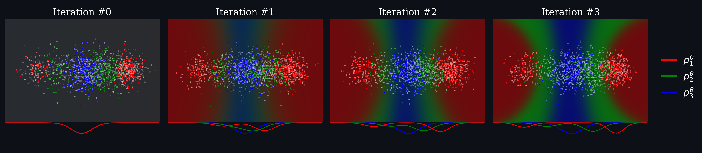

# diffclf

[](https://arxiv.org/abs/2601.21025)

Reference implementation of **A Diffusive Classification Loss for Learning Energy-based Generative Models**, accepted at *ICML 2026*.

> RuiKang OuYang*, Louis Grenioux*, José Miguel Hernández-Lobato. *A Diffusive Classification Loss for Learning Energy-based Generative Models.* ICML 2026. [[arXiv]](https://arxiv.org/abs/2601.21025)

## Overview

Time-dependent energy-based models (EBMs) unlock applications that pure score networks cannot — compositional sampling, Boltzmann Generators, importance weighting — but training them is hard: maximum likelihood needs nested sampling, and score matching suffers from mode blindness. We propose **Diffusive Classification (DiffCLF)**, which reframes EBM learning as a supervised classification problem across noise levels along a diffusion path. It is cheap to compute, avoids the mode-blindness pathology, and composes naturally with standard score-based objectives. We validate the resulting energies against ground truth on Gaussian mixtures and apply the trained EBMs to compositional sampling and Boltzmann Generator tasks.



Each panel shows the EBM `p_t^θ` at three successive noise levels: as the classifier loss converges, the EBM learns to distinguish noised samples between adjacent levels, which is equivalent to matching the marginal energies along the path.

## Citation

```bibtex
@inproceedings{ouyang2026diffusiveclassificationlosslearning,
      title={A Diffusive Classification Loss for Learning Energy-based Generative Models},
      author={RuiKang OuYang and Louis Grenioux and José Miguel Hernández-Lobato},
      booktitle={Forty-third International Conference on Machine Learning},
      year={2026},
      url={https://arxiv.org/abs/2601.21025},
}
```

## Installation

Requires Python ≥ 3.12 and a recent PyTorch.

```bash
git clone https://github.com/h2o64/diffclf.git
cd diffclf
pip install -e .
```

The runtime dependencies (PyTorch, NumPy, SciPy, Matplotlib, tqdm, [POT](https://pythonot.github.io/), [normflows](https://github.com/VincentStimper/normalizing-flows)) are declared in `pyproject.toml` and installed automatically.

For the **alanine-dipeptide (ALDP)** experiments, also install the optional MD stack:

```bash
pip install -e '.[aldp]'
```

This pulls in `boltzgen`, `mdtraj`, and `openmmtools` (which depends on OpenMM). The toy/GMM benchmarks do not need it.

The molecular experiments also rely on **ScoreMD** for Boltzmann energy plumbing — specifically [h2o64/ScoreMD](https://github.com/h2o64/ScoreMD), a fork of [noegroup/ScoreMD](https://github.com/noegroup/ScoreMD). Two extra data files are needed:

* `train.h5` — implicit-solvent ALDP trajectory, downloadable from the Zenodo record <https://zenodo.org/records/6993124>;
* `aldp_vacuum.pt` — vacuum-conformation tensor, available from the [FEAT](https://github.com/jiajunhe98/FEAT) repository.

Point `--data_path` / `--vacuum_datapath` at the resulting files.

## Package layout

```
diffclf/
├── distr/        # Target distributions: Gaussian/MOG, TwoModes, FourtyModesMOG, AlanineDipeptide
├── em/           # Energy-classification losses (bi_level, multi_level, +bregman variants)
│                 # and energy regularizers (cond_nce, rne, time_sm)
├── sm/           # Plain score-matching losses (DSM/TSM/EDM) used for score pretraining
├── sde/          # Linear VP / VE / EDM diffusions and time samplers
├── si/           # Stochastic interpolant
├── networks/     # MLP, Fourier MLP, EGNN, EBM wrappers, EDM preconditioning
├── smc/          # Diffusion AIS, PDDS samplers
├── re/           # Replica-exchange sampler over the diffusion path
├── mcmc/         # MALA + step-size heuristics (used by smc/, re/)
├── metrics/      # KLD, KS, MMD, Wasserstein
└── utils/        # SE(3) helpers, plotting
```

## Reproducing the experiments

Every experiment lives in `experiments/` and is a standalone `argparse` script. Pickled checkpoints/results are written to `--results_path` after each run. The scripts fall into three stages:

| stage | what it does | scripts |
|---|---|---|
| **1. pre-train a score model** | DSM/TSM/EDM on the diffusion path; produces a score checkpoint | `energy_clf_sm_only.py`, `energy_clf_sm_only_aldp.py`, `energy_clf_si_sm_only.py`, `energy_clf_si_sm_only_aldp.py`, `energy_clf_si_tsm_only_aldp.py`, `energy_clf_si_vel_only_aldp.py` |
| **2. fit the EBM** | initialised from the score checkpoint. `--loss_type bi_level / multi_level` (+ `_bregman`) are the diffusive **classification** losses introduced by the paper; `--loss_type cond_nce / rne / tsm / sm` are baseline **energy regularizers** kept for comparison | `energy_clf_from_sm.py`, `energy_clf_from_sm_aldp.py`, `energy_clf_si_from_sm.py`, `energy_clf_si_from_sm_aldp.py`, `energy_clf_si_from_tsm_aldp.py` |
| **3. evaluate / sample the EBM** | recalibration with SMC samplers (PDDS / diffusion-AIS), replica exchange, sampling, free-energy estimation | `recalibration_aldp.py`, `recalibration_si_aldp.py`, `recalibration_si_aldp_re.py`, `recalibration_si_gmm.py`, `sample_si_aldp.py`, `free_energy_TI_si_aldp.py` |

### Toy / GMM benchmark (no MD dependencies)

Pre-train a score model on a 128-d 40-mode Gaussian mixture:

```bash
mkdir -p results/sm_gmm
python experiments/energy_clf_sm_only.py \
    --results_path results/sm_gmm \
    --target_type gmm40 \
    --dim 128 \
    --sde_type vp \
    --seed 0
```

(`--target_type two_modes` switches to the two-mode benchmark; `--sde_type {vp,edm}` picks the diffusion.)

Then fit the EBM on top of that checkpoint using the diffusive **classification** loss:

```bash
mkdir -p results/clf_gmm
python experiments/energy_clf_from_sm.py \
    --results_path results/clf_gmm \
    --cpkt_filepath results/sm_gmm/energy_clf_sm_only_target_type_gmm40_dim_128_seed_0.pkl \
    --loss_type bi_level \
    --k 4 \
    --seed 0
```

`--loss_type` selects the EBM training objective. The diffusive **classification losses** proposed by the paper are `bi_level`, `bi_level_bregman`, `multi_level`, `multi_level_bregman`; the **energy-regularizer baselines** are `cond_nce`, `rne`, `tsm`, `sm`. `--k` controls the level-gap used by the bi-/multi-level classifier objective.

### Stochastic-interpolant variant (still GMM)

```bash
mkdir -p results/si_sm_gmm
python experiments/energy_clf_si_sm_only.py \
    --results_path results/si_sm_gmm \
    --dim 128 \
    --dsm_weighting_type square \
    --seed 0

mkdir -p results/si_clf_gmm
python experiments/energy_clf_si_from_sm.py \
    --results_path results/si_clf_gmm \
    --ckpt_filepath results/si_sm_gmm/energy_clf_si_sm_only_dim_128_dsm_weighting_type_square_seed_0.pkl \
    --loss_type bi_level \
    --k 4 \
    --seed 0

python experiments/recalibration_si_gmm.py \
    --results_path results/recalib_gmm \
    --ckpt_filepath results/si_clf_gmm/<one of the produced .pkl> \
    --dim 128 \
    --seed 0
```

### Alanine-dipeptide (ALDP)

The ALDP scripts expect two extra files (produced via ScoreMD): a training trajectory `train.h5` and a vacuum-conformation tensor `aldp_vacuum.pt`. Once they are in place:

```bash
# 1. Score / velocity pretraining
python experiments/energy_clf_si_sm_only_aldp.py \
    --results_path results/aldp_si_sm \
    --data_path data/train.h5 \
    --vacuum_datapath data/aldp_vacuum.pt \
    --gamma_factor 1.0 \
    --seed 0

python experiments/energy_clf_si_vel_only_aldp.py \
    --results_path results/aldp_si_vel \
    --data_path data/train.h5 \
    --vacuum_datapath data/aldp_vacuum.pt \
    --gamma_factor 1.0 \
    --seed 0

# 2. EBM training with the classification loss
python experiments/energy_clf_si_from_sm_aldp.py \
    --results_path results/aldp_clf \
    --data_path data/train.h5 \
    --vacuum_datapath data/aldp_vacuum.pt \
    --ckpt_filepath results/aldp_si_sm/<score-checkpoint>.pkl \
    --vel_ckpt_filepath results/aldp_si_vel/<velocity-checkpoint>.pkl \
    --loss_type bi_level \
    --k 2 \
    --seed 0

# 3a. Recalibrate / sample / replica-exchange
python experiments/recalibration_si_aldp.py \
    --results_path results/aldp_recalib \
    --data_path data/train.h5 \
    --vacuum_datapath data/aldp_vacuum.pt \
    --ckpt_filepath results/aldp_clf/<ebm-checkpoint>.pkl \
    --seed 0

python experiments/sample_si_aldp.py \
    --results_path results/aldp_samples \
    --data_path data/train.h5 \
    --vacuum_datapath data/aldp_vacuum.pt \
    --velocity_ckpt_filepath results/aldp_si_vel/<velocity-checkpoint>.pkl \
    --score_ckpt_filepath  results/aldp_si_sm/<score-checkpoint>.pkl \
    --use_sde_sampling --diff_val 1.0 \
    --seed 0

# 3b. Free energy via thermodynamic integration
python experiments/free_energy_TI_si_aldp.py \
    --results_path results/aldp_free_energy \
    --data_path data/train.h5 \
    --vacuum_datapath data/aldp_vacuum.pt \
    --ckpt_filepath results/aldp_clf/<ebm-checkpoint>.pkl \
    --use_ema \
    --seed 0
```

For everything else, `python experiments/<script>.py --help` lists the full set of flags.

## License

Code is released for academic use accompanying the paper. Please cite the bibtex above if you use it.
